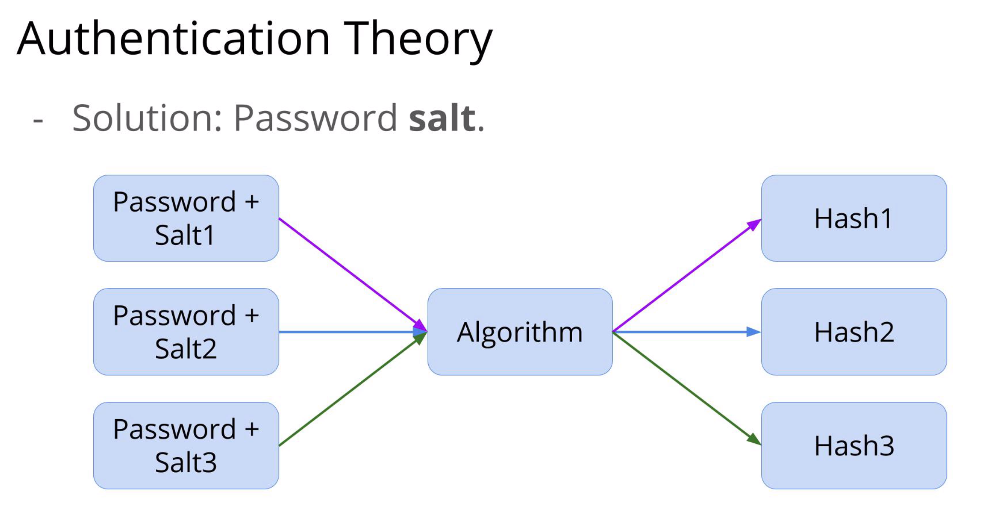

# Authentication Theory

We combine the password with a random "Salt" that is generated and pass it through an algorithm to generate the Hash

- A salt is an additional piece of data that is added to the password before hashing it. The purpose of the salt is to ensure that even if two users have the same password, their hashes will be different, because their salts will be different.

- The algorithm is a Cryptography algorithm (bcrypt, scrypt, Argon2, or PBKDF2)